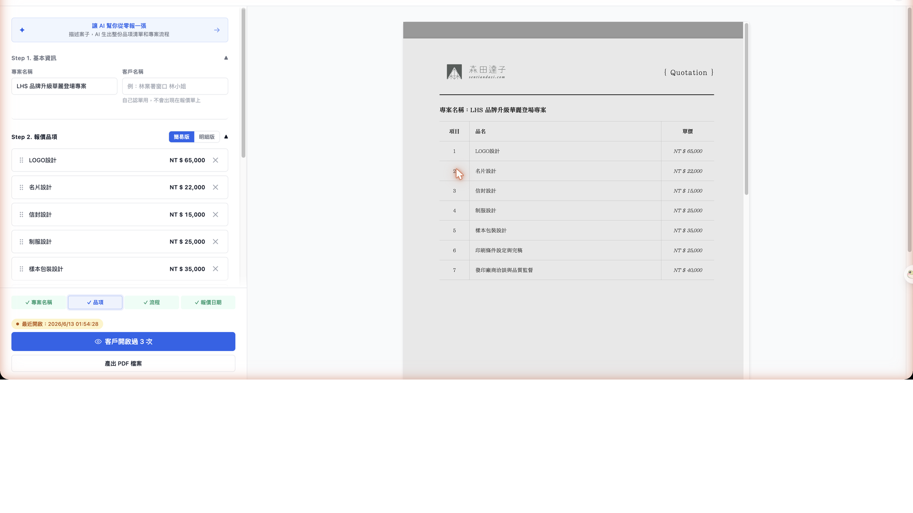
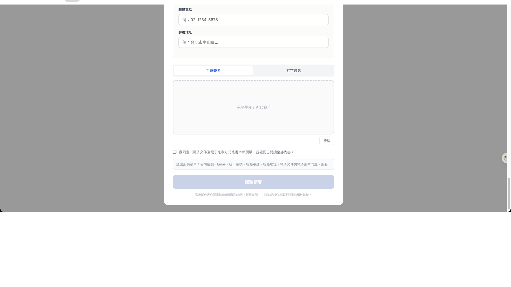
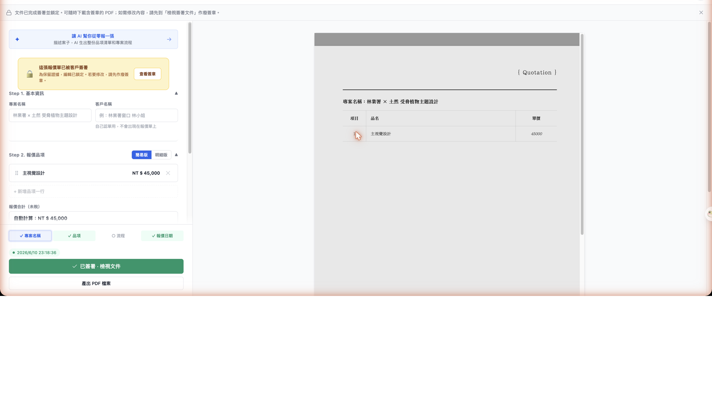
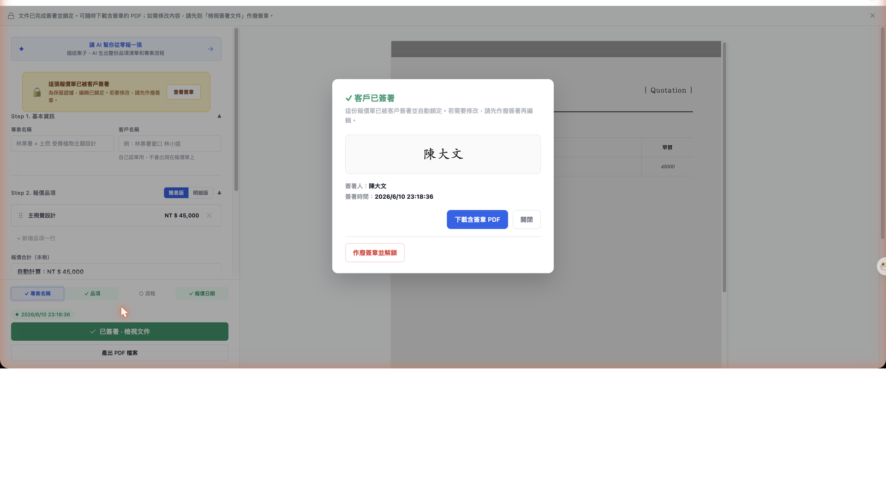

# AI-Powered Quotation System for Design Studios

A production tool used by a visual design studio in Taiwan. Designers describe a project, AI generates a quotation draft, clients e-sign online — quotation to signature in one workflow.

## Workflow

**1. AI Quotation Generation**
Designer describes the project. AI asks 2–4 clarifying questions (deliverables, timeline, scope), then generates a complete item list with pricing.

**2. Designer Review & Edit**
AI output is a draft. Designer adjusts prices, adds/removes items, reorders by drag-and-drop. Live PDF preview updates in real time on the right panel.

**3. Share with Client**
Designer generates a secure link. Client opens it on any device — no login, no app. Shows a read-only PDF preview.

**4. Client E-Signature**
Client signs directly on the page — handwritten (canvas) or typed. Once signed, the quotation locks automatically. Designer gets notified and can download the signed PDF.

## Design

Editor: Figma-inspired, clean and functional (for designers).
PDF output: Traditional Chinese typography, formal (for clients).

## Stack

Node.js, Express, Vue 3, Claude AI, Puppeteer, Turso/libSQL.
